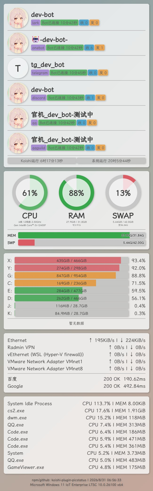
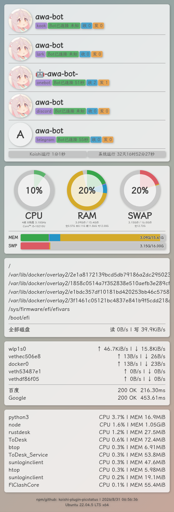

# 📊 koishi-plugin-picstatus 🖼️

<p>
  <a href="https://www.npmjs.com/package/koishi-plugin-picstatus" target="_blank">
    
  </a>
  <a href="https://www.npmjs.com/package/koishi-plugin-picstatus" target="_blank">
    
  </a>
  <a href="./LICENSE">
    
  </a>
  <br>
  <a href="https://github.com/VincentZyuApps/koishi-plugin-picstatus" target="_blank">
    
  </a>
  <a href="https://gitee.com/vincent-zyu/koishi-plugin-picstatus" target="_blank">
    
  </a>
  <br>
  <a href="https://forum.koishi.xyz/t/topic/xxxxx" target="_blank">
    
  </a>
  <a href="https://qm.qq.com/q/ZHj33L5cuC" target="_blank">
    
  </a>
</p>

## 💬 交流反馈

🐛 Bug 反馈 / 💡 建议 / 👨‍💻 插件开发交流，欢迎加群：

~~QQ群：**259248174**（该群已停用）~~

QQ群：**1085190201** 🎉

💡 在群里直接艾特我，回复会更快哦~ ✨

跨平台采集当前设备与 Koishi 的运行状态，并通过 Puppeteer 渲染为图片。

## 🖼️ 状态图预览

### Windows



### Linux



## ✨ 功能

- 展示 CPU、内存、Swap、磁盘容量与 IO、逐网卡流量、进程排行和网站连通性。
- 展示 Koishi Bot 的平台、账号、昵称、连接时间与消息收发数量。
- 支持浅色和深色主题，以及模糊、圆角、阴影效果开关。
- 支持消息图片、内置背景、本地文件或目录、远程 URL 和无背景模式。
- 支持 npm 内置、Release 下载、自定义路径和系统默认字体四种模式。
- 支持 Windows、Linux、macOS 与容器环境，单项采集失败不会中断整张图片。
- 提供进程排序、显示数量和图片主题三个仅对本次出图生效的指令选项。

## 📦 安装与依赖

在 Koishi 插件市场中搜索并安装 `picstatus`，然后启用以下服务：

| 服务 | 是否必需 | 用途 |
| --- | --- | --- |
| `puppeteer` | 是 | 渲染并截取状态图片 |
| `http` | 是 | 获取头像、远程背景、网站状态和 Release 字体 |
| `database` | 否 | 持久化 Bot 消息计数 |

> 未启用 `puppeteer` 或 `http` 时，Koishi 不会加载本插件。选择 database 计数模式但服务不可用时，插件会记录警告并继续使用内存计数。

## ⌨️ 指令

默认指令：

```text
picstatus
```

默认别名为 `运行状态`、`状态`、`zt` 和 `yxzt`。别名与其他插件冲突时会自动跳过，不影响插件加载。

### 临时选项

```text
picstatus -s memory -n 10 -t dark
```

| 选项 | 可选值 | 说明 |
| --- | --- | --- |
| `-s, --sort <sort>` | `cpu`、`memory` | 设置本次进程排行榜的排序方式 |
| `-n, --count <count>` | `0-100` | 设置本次显示的进程数量，`0` 表示隐藏进程数据 |
| `-t, --theme <theme>` | `light`、`dark` | 设置本次图片主题 |

> 这些选项只覆盖本次请求，不会修改 Koishi 控制台中的全局配置。
>
> 插件默认会先发送“正在采集并渲染”的等待提示；状态图片发送成功后会自动撤回该消息。

## ⚙️ 配置项

### 📌 指令设置

| 配置项 | 类型 | 默认值 | 说明 |
| --- | --- | --- | --- |
| `command` | `string` | `picstatus` | 主指令名称，建议避免使用容易与官方插件冲突的 `status` |
| `aliases` | `string[]` | `运行状态, 状态, zt, yxzt` | 指令别名，冲突项会被跳过 |
| `authority` | `number` | `1` | 执行指令需要的最低权限等级 |
| `showCurrentBot` | `boolean` | `false` | 是否只展示收到指令的当前 Bot |
| `reply` | `boolean` | `true` | 发送提示、图片或错误时是否引用触发消息 |
| `enableWaitingHint` | `boolean` | `true` | 是否发送采集渲染提示，并在成功后撤回 |

### 🖼️ 图片设置

| 配置项 | 类型 | 默认值 | 说明 |
| --- | --- | --- | --- |
| `components` | `ComponentName[]` | 全部组件 | 图片组件及排列顺序，可删除或拖动调整 |
| `imageType` | `jpeg \| png` | `jpeg` | 输出图片格式 |
| `imageQuality` | `number` | `90` | JPEG 截图质量，范围 `1-100`，PNG 不使用该值 |
| `imageWidth` | `number` | `650` | 图片宽度，范围 `480-1600` px |
| `theme` | `light \| dark` | `light` | 默认明暗主题 |
| `fontMode` | `npm \| release \| custom \| system` | `npm` | 图片字体来源 |
| `customFontPath` | `string` | 空 | 自定义字体绝对路径，仅 custom 模式生效 |
| `disableBlur` | `boolean` | `false` | 关闭卡片毛玻璃效果 |
| `disableRadius` | `boolean` | `false` | 关闭卡片、标签和头像圆角 |
| `disableShadow` | `boolean` | `false` | 关闭组件和文字阴影 |

> `components` 支持 `header`、`cpu`、`disk`、`network`、`process`、`footer`。默认按照该顺序显示全部组件。

> #### 🔤 字体模式
>
> ##### npm 模式（默认）
>
> 直接使用依赖包 `lxgw-wenkai-screen-web` 中的 WOFF2 字体切片。字体通过 Puppeteer 请求拦截从本地加载，不访问公共字体 CDN，适合绝大多数环境。
>
> ##### Release 模式
>
> 仅在选择该模式后检查以下公共字体文件：
>
> ```text
> ctx.baseDir/data/fonts/LXGWWenKaiMono-Regular.ttf
> ```
>
> 文件不存在或完整性校验失败时，会优先从 Gitee Release 下载，失败后回退到 GitHub Release。下载结果通过文件大小、MD5、SHA-1、SHA-256 与 SHA-512 校验后才会使用。该路径与其他插件共享，已有有效字体不会重复下载。
>
> ##### custom 模式
>
> 填写字体文件的绝对路径，支持 `.ttf`、`.otf` 和 `.woff2`。插件会验证路径、文件大小与字体文件头；配置无效时会终止本次出图并提示检查后台日志。
>
> ##### system 模式
>
> 不注入插件字体，直接使用 Puppeteer 所在系统可用的默认字体。容器中使用该模式时，请自行安装支持中文的字体。

### 📊 采集设置

| 配置项 | 类型 | 默认值 | 说明 |
| --- | --- | --- | --- |
| `collectInterval` | `number` | `10` | 后台采样间隔，单位秒 |
| `collectTimeout` | `number` | `10` | 单项状态采集超时，单位秒 |
| `requestTimeout` | `number` | `8` | 网站、头像和远程背景请求超时，单位秒 |
| `sites` | `{ name, url }[]` | 百度、Google | 网站状态与响应延迟检测列表 |
| `processCount` | `number` | `10` | 进程排行榜条数，范围 `0-100`，`0` 表示隐藏 |
| `processSort` | `cpu \| memory` | `cpu` | 进程排行榜排序依据 |
| `ignoredProcesses` | `string[]` | 空 | 忽略的进程名称正则，不区分大小写 |
| `ignoredDisks` | `string[]` | 空 | 忽略的磁盘挂载点正则，不区分大小写 |
| `ignoredNetworks` | `string[]` | 回环接口规则 | 忽略的网卡名称正则，不区分大小写 |
| `hideIdleIo` | `boolean` | `false` | 隐藏当前读写或收发速度均为零的磁盘与网卡 |
| `memoryPercentMode` | `platform \| available \| occupied` | `platform` | RAM 圆环中心百分比口径（实验性） |
| `showMemoryBars` | `boolean` | `true` | 显示全平台 MEM 与 SWP 横条（实验性） |

> #### 🧠 内存显示口径
>
> `platform` 使用各平台推荐口径：Linux 和 Termux/Android 对应 htop 右侧的 used（绿色 used + 紫色 shared + compressed），Windows 对应物理已用内存，macOS 对应 active。`available` 使用 `(总量 - 可用) / 总量`，`occupied` 使用 `(总量 - 空闲) / 总量`。此配置同时控制 RAM 圆心百分比及下方第一行“已用 / 总量”的已用口径，保证两处数值一致。
>
> Linux RAM 圆环按 htop 分类显示：绿色 used、紫色 shared、深灰 compressed、蓝色 buffers、黄色 cache。圆环的分段长度始终表示真实分类，不会随中心百分比口径改变。圆环下方第一行保留“已用 / 总量”格式，第二行显示空闲、共享、buff/cache 与可用；SWAP 同样在第一行显示“已用 / 总量”，第二行显示空闲。
>
> MEM 横条会按各平台真实可获取的数据染色：Linux 使用完整 htop 分类；Termux/Android 优先读取 `/proc/meminfo` 使用同一分类，失败后回退为通用 used/cache/free；Windows 显示绿色物理已用和灰色可用；macOS 显示绿色 active、黄色 cache 和灰色剩余；其他平台显示可获得的 used、cache 和剩余。SWP 横条使用红色 used、黄色 cached 和灰色 free，Windows 的 SWAP 表示 pagefile，未配置时显示“未配置”。
>
> `showMemoryBars` 控制所有平台状态图底部的 MEM/SWP 横条；关闭后仍保留分类圆环和紧凑数字。横条文字采用平台分类对应的 used / total，不随 `memoryPercentMode` 改变。第一行会在 KiB、MiB、GiB 等 IEC 单位间自适应，第二行和横条数值固定使用两位小数 GiB，避免 `free -g` 的整数取整误差。

> Windows 会分别显示可用网卡，例如物理 Ethernet、VPN 与虚拟网卡。可以通过 `ignoredNetworks` 排除不希望展示的接口，例如：
>
> ```text
> ^Radmin VPN$
> ^VMware Network Adapter
> ```
>
> 忽略项会作为正则表达式编译；无效规则会被跳过，因此建议先验证表达式是否符合预期。

### 🌄 背景设置

| 配置项 | 类型 | 默认值 | 说明 |
| --- | --- | --- | --- |
| `backgroundMode` | `builtin \| local \| url \| none` | `builtin` | 默认背景来源 |
| `backgroundPath` | `string` | `data/picstatus/backgrounds` | 本地背景文件或目录，相对路径基于 `ctx.baseDir` |
| `backgroundUrl` | `string` | 空 | 固定远程背景地址，仅 URL 模式生效 |
| `preloadCount` | `number` | `2` | 后台预加载数量，范围 `0-20`，`0` 表示禁用 |

> 背景选择优先级如下：
>
> 1. 当前消息或引用消息中的第一张图片。
> 2. `backgroundMode` 指定的背景来源。
> 3. 配置背景读取失败时使用内置背景。
>
> local 模式可以填写单个图片文件，也可以填写目录；目录模式会随机选择支持的图片。远程背景和消息图片会经过响应大小及 MIME 类型检查。

### 🧠 统计与调试

| 配置项 | 类型 | 默认值 | 说明 |
| --- | --- | --- | --- |
| `counterStorage` | `memory \| database` | `memory` | Bot 消息计数存储方式 |
| `resetCounterOnDisconnect` | `boolean` | `true` | Bot 断开时是否重置内存计数，database 模式不受影响 |
| `debug` | `boolean` | `false` | 输出详细采集和渲染日志 |

> memory 模式无需数据库，Koishi 重启后计数会清空。database 模式按 `platform:selfId` 隔离保存，适合需要跨重启累计统计的实例。

## 📜 来源与许可

本项目参考并移植自 [nonebot-plugin-picstatus](https://github.com/lgc-NB2Dev/nonebot-plugin-picstatus)，原项目由 LgCuwukii 等贡献者开发并采用 MIT License。

插件本体依据 [MIT License](./LICENSE) 发布。`lxgw-wenkai-screen-web` 的 npm 封装依据 MIT License 分发，LXGW WenKai Screen 与 LXGW WenKai Mono 字体依据 SIL Open Font License 1.1 分发。

完整的第三方版权与许可证声明请查看 [notices.md](./notices.md)。
